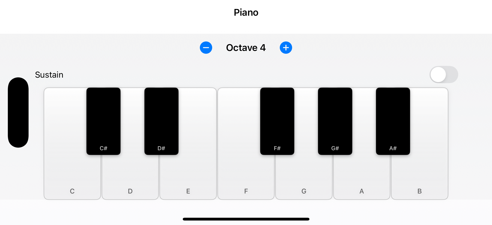

## 🎹 Piano

A modern, responsive iOS piano keyboard built with SwiftUI and AVAudioEngine. Features a scrollable 7-octave keyboard with customizable settings, haptic feedback, and realistic piano sound using SoundFont technology.



### ✨ Features
- **🎹 7-Octave Keyboard**: Full piano range from C1 to B7 with smooth horizontal scrolling
- **🧭 Interactive Navigation**: Octave buttons and scroll slider for quick navigation
- **⚙️ Customizable Settings**: Adjustable key width, key name display options, and haptic feedback
- **🎵 Realistic Audio**: SoundFont-backed piano sound with low-latency playback
- **📱 Modern UI**: SwiftUI interface with responsive keys and smooth animations
- **🏗️ MVVM Architecture**: Clean separation with `@Observable` view models and Swift concurrency

### 🏗️ Architecture
- **📋 Pattern**: MVVM with Swift concurrency
- **🎛️ ViewModel**: `@Observable` and `@MainActor`-scoped for UI-safe state management
- **🔊 Audio**: `AVAudioEngine` + `AVAudioUnitSampler` for SoundFont playback
- **💾 State Management**: User preferences stored with `@AppStorage`

**🔄 Data Flow**:
- 📱 `PianoView` renders the scrollable keyboard and handles user interactions
- 🎚️ `PianoViewModel` manages key state, scroll position, and audio playback
- 🔊 `AudioEngine` service handles audio session and SoundFont loading
- ⚙️ `SettingsView` provides customization options with persistent storage

### 🛠️ Requirements
- 💻 Xcode 15 or later
- 📱 iOS 17 or later (SwiftUI `@Observable` macro)
- 🖥️ macOS Sonoma or later for development

### 🚀 Getting Started
1. 📥 Clone the repository
```bash
git clone https://github.com/banghuazhao/Piano.git
cd Piano
```
2. 🔧 Open the project in Xcode
```bash
open Piano.xcodeproj
```
3. ▶️ Select the `Piano` scheme and a simulator or device, then Run.

**📝 Note**: If you replace the SoundFont, put your `.sf2` file in `Piano/Sound/` and update the load call if needed.

### 📁 Project Structure
```text
Piano/
  App/                 # 🚀 App entry point (`PianoApp.swift`)
  Sound/               # 🎵 SoundFont file (`Piano.sf2`)
  Assets.xcassets/     # 🎨 App icons and colors
  Config/              # ⚙️ Build configurations
  Model/               # 📋 `PianoKey`, `PianoNote`, `OctaveColor`
  Service/             # 🔊 `AudioEngine` for audio playback
  View/                # 📱 `PianoView`, `PianoKeyView`, `SettingsView`
  ViewModel/           # 🎛️ `PianoViewModel` with @Observable
```

### 🎼 Usage
- **🎹 Playing Notes**: Tap any key to play piano notes with realistic sound
- **🧭 Navigation**: 
  - Use octave buttons (C1-C7) to jump to specific octaves
  - Drag the scroll slider to navigate smoothly across the keyboard
  - Swipe horizontally on the keyboard for fine control
- **⚙️ Settings**: Tap the gear icon to access:
  - Key width adjustment (30-80 points)
  - Show/hide key names on keys
  - Toggle haptic feedback
  - Octave-specific key name display options
- **🎨 Customization**: Replace `Piano.sf2` with your own SoundFont file to change the piano sound

### 🗺️ Roadmap
- **👆 Multi-touch Support**: Enhanced chord playing with multiple simultaneous notes
- **🎛️ Sustain Pedal**: Virtual sustain pedal functionality
- **🎹 MIDI Support**: MIDI input/output for external controllers
- **🎙️ Recording**: Basic recording and playback capabilities
- **✨ Visual Feedback**: Enhanced visual indicators for active notes
- **🎚️ Custom Key Ranges**: Configurable octave ranges and key layouts

### 🤝 Contributing
- 📝 Open an issue or pull request on GitHub
- 🏗️ Follow MVVM architecture with `@Observable` view models and Swift concurrency
- 🔧 Prefer small, well-scoped changes
- 📚 Maintain consistent code style and documentation

### 📄 License
No license file is included yet. If you intend to use this project beyond personal use, please add a license.

### 🙏 Acknowledgements
- 🛠️ Built with SwiftUI and AVFoundation
- 🎵 Uses a bundled SoundFont file (`Piano.sf2`). Replace with your own if licensing requires.
- ©️ Copyright Apps Bay Limited. All rights reserved.

### 🔗 Links
- 📦 Repository: `https://github.com/banghuazhao/Piano`
