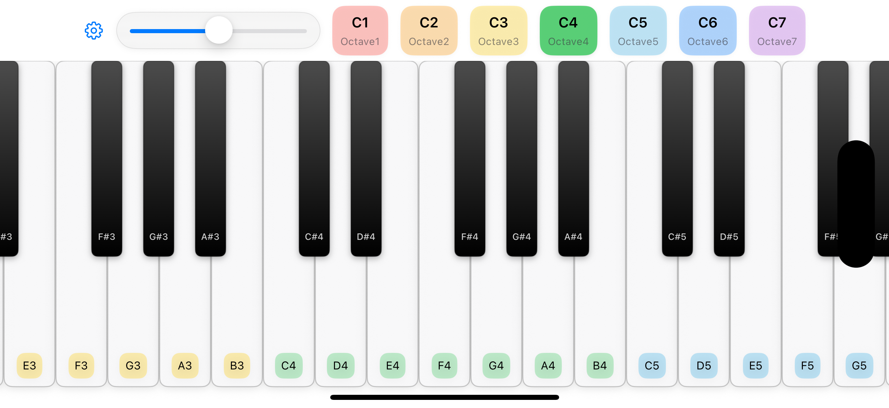

## 🎹 Piano

A simple, fast, and accessible iOS piano keyboard built with SwiftUI and AVAudioEngine. It uses MVVM with Swift Concurrency and the `@Observable` macro to manage view state, and loads a SoundFont (`Piano.sf2`) for realistic piano playback.



### ✨ Features
- 🎵 Play piano notes with low-latency audio
- 🧭 SwiftUI interface with responsive keys
- 🧠 MVVM with `@Observable` and `@MainActor`-scoped ViewModels
- 🎛️ SoundFont-backed timbre via `AVAudioUnitSampler`
- 🧩 Lightweight model types for notes and keys

### 🧱 Architecture
- **Pattern**: MVVM
- **ViewModel**: Annotated with `@Observable` and `@MainActor` to ensure UI-safe state updates
- **Concurrency**: Uses Swift concurrency instead of Combine for async work
- **Audio**: `AVAudioEngine` + `AVAudioUnitSampler` to load and play `Piano.sf2`

High-level flow:
- 📱 `View` renders keys and forwards user interactions to `ViewModel`
- 🎚️ `ViewModel` updates state and invokes `AudioEngine` services
- 🔊 `Service` handles audio session, engine graph, and SoundFont loading

### 🛠️ Requirements
- Xcode 15 or later
- iOS 17 or later (SwiftUI `@Observable` macro)
- macOS Sonoma or later for development

### 🚀 Getting started
1. Clone the repository
```bash
git clone https://github.com/banghuazhao/Piano.git
cd Piano
```
2. Open the project in Xcode
```bash
open Piano.xcodeproj
```
3. Select the `Piano` scheme and a simulator or device, then Run.

If you replace the SoundFont, put your `.sf2` file in `Piano/Sound/` and update the load call if needed.

### 🗂️ Project structure
```text
Piano/
  App/                 # App entry (`PianoApp.swift`)
  Sound/               # SoundFont (`Piano.sf2`)
  Assets.xcassets/     # App icons and colors
  Config/              # Build configurations
  Model/               # `PianoKey`, `PianoNote`
  Service/             # `AudioEngine`
  View/                # `ContentView`, `PianoKeyboardView`, `PianoKeyView`
  ViewModel/           # `PianoViewModel`
```

### 🎼 Usage
- Tap keys to play notes
- Velocity is currently uniform; you can extend the model to vary velocity by touch pressure (where available) or vertical position
- Replace `Piano.sf2` to change timbre; ensure the file is included in the app bundle

### ✅ Testing
This project uses the Swift Testing framework (`import Testing`) rather than XCTest.
- Add tests under a `Tests` target using Swift Testing conventions
- Example scaffold:
```swift
import Testing
@testable import Piano

struct PianoTests {
    @Test func canInstantiateViewModel() async throws {
        _ = PianoViewModel()
    }
}
```

### 🗺️ Roadmap
- Sustain pedal and multi-touch chord improvements
- Configurable key ranges and octaves
- MIDI input/output support
- Visual feedback for active notes
- Basic recording and playback

### 🤝 Contributing
- Open an issue or pull request on GitHub
- Keep to MVVM with `@Observable` view models and Swift concurrency
- Prefer small, well-scoped changes

### 📄 License
No license file is included yet. If you intend to use this project beyond personal use, please add a license.

### 🙏 Acknowledgements
- Built with SwiftUI and AVFoundation
- Uses a bundled SoundFont file (`Piano.sf2`). Replace with your own if licensing requires.

### 🔗 Links
- Repository: `https://github.com/banghuazhao/Piano`
